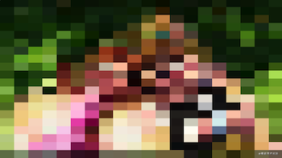
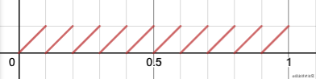

# GPUImage滤镜实现分析

[toc]

### 摘要

本文主要学习GPUImage滤镜算法，并进行实践。网上有很多介绍GPUImage的文章，这里就不再赘述。GPUImage内置100多种滤镜，其中有简单的，也有复杂的。为了节约大家的阅读时间，简单的滤镜只介绍原理，不放效果图；如果大家对着色器编程感兴趣，推荐大家去[ShaderToy](https://www.shadertoy.com/)这个网站(能快速的预览渲染效果)。因为实践是在ShaderToy上进行的，这里简单介绍一下一些内置变量和内置函数。

 - 内置变量:

   >`fragCoord`:二维变量，表示画布的宽高;`iResolution`:二维常量，也表示画布的宽高。`texture(通道，纹理坐标)`函数:读取通道中的纹理，类似GLSL中的`sample2D`函数。
- 内置函数:

   > `length(x)`:获取向量x的模长;

### 滤镜

#### 马赛克滤镜

- `GPUImagePixellateFilter`

普通的马赛克滤镜:

滤镜分析:

` mod`函数:
$$
mod(x,y) = x - y * floor(\frac xy)
$$
 假设采样的大小是`sampleFactor = 0.1`(只考虑水平方向上)，`mod(x,sampleFactor)`即为$y = x - 0.1 * floor(\frac x{0.1})$,生成的图像如下(10个采样周期 $SampleCycle = \frac {1.0}{sampleFactor}$)

​     
​     - `GPUImagePixellatePositionFilter`
​     - `GPUImagePolarPixellateFilter`

